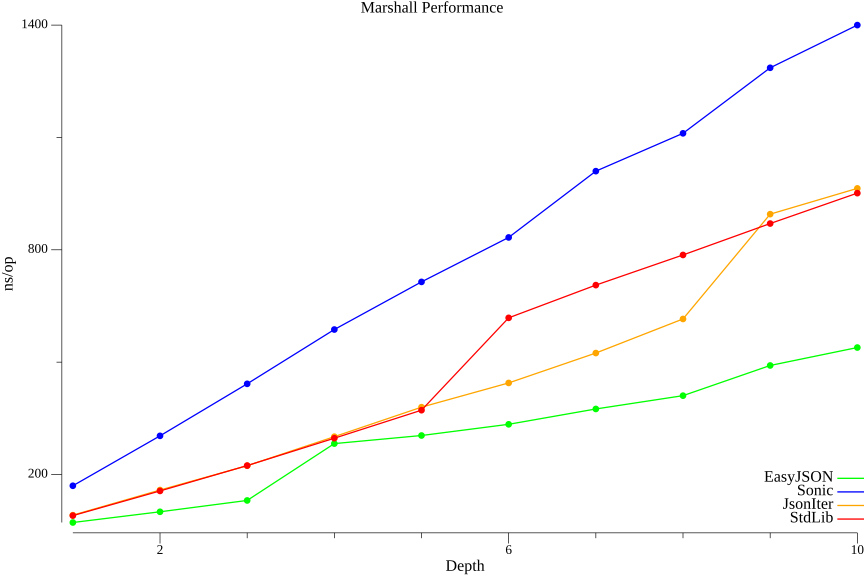
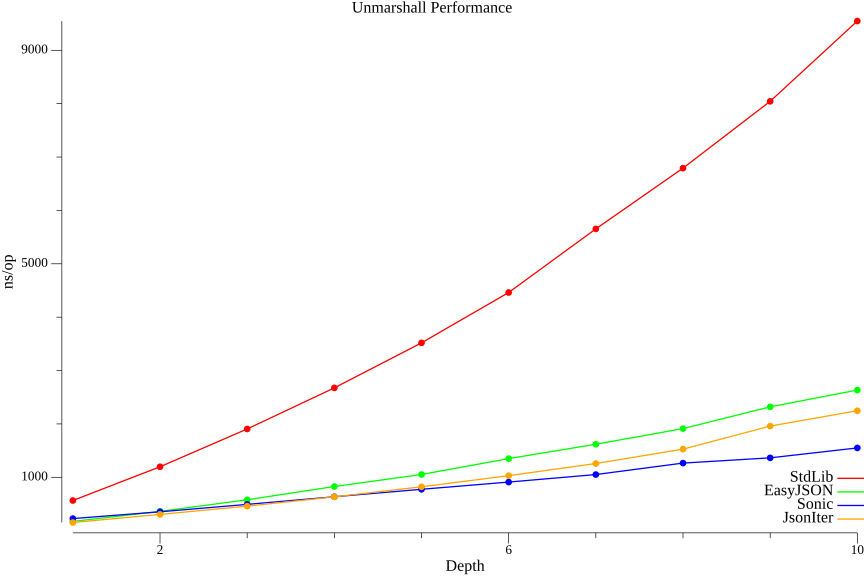
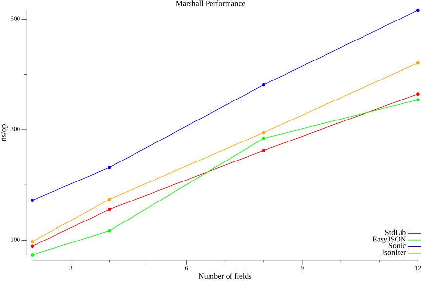
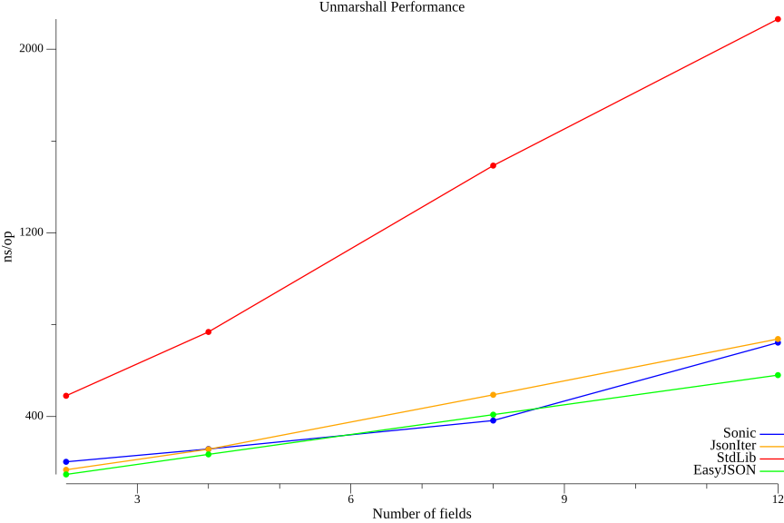

# Бенчмарки

## Сложные большие структуры

```mermaid
gantt
title Marshal - canada_geometry (MB/s - higher is better)
dateFormat X
axisFormat %s

section bytedance/sonic-12       
376 :0, 376
section encoding/json-12         
295 :0, 295
section json-iterator/go-12      
329 :0, 329
section mailru/easyjson-12       
330 :0, 330
```

```mermaid
gantt
title Marshal - citm_catalog (MB/s - higher is better)
dateFormat X
axisFormat %s

section bytedance/sonic-12          
1485 :0, 1485
section encoding/json-12            
2894 :0, 2894
section json-iterator/go-12         
2977 :0, 2977
section mailru/easyjson-12          
4598 :0, 4598
```

```mermaid
gantt
title Marshal - golang_source (MB/s - higher is better)
dateFormat X
axisFormat %s

section bytedance/sonic-12         
472 :0, 472
section encoding/json-12           
736 :0, 736
section json-iterator/go-12        
731 :0, 731
section mailru/easyjson-12         
987 :0, 987
```

```mermaid
gantt
title Marshal - string_unicode (MB/s - higher is better)
dateFormat X
axisFormat %s

section bytedance/sonic-12        
4626 :0, 4626
section encoding/json-12          
871 :0, 871
section json-iterator/go-12       
920 :0, 920
section mailru/easyjson-12        
1012 :0, 1012
```

```mermaid
gantt
title Marshal - synthea_fhir (MB/s - higher is better)
dateFormat X
axisFormat %s

section bytedance/sonic-12          
341 :0, 341
section encoding/json-12            
332 :0, 332
section json-iterator/go-12         
454 :0, 454
section mailru/easyjson-12          
848 :0, 848
```

```mermaid
gantt
title Marshal - twitter_status (MB/s - higher is better)
dateFormat X
axisFormat %s

section bytedance/sonic-12        
1316 :0, 1316
section encoding/json-12          
1391 :0, 1391
section json-iterator/go-12       
1134 :0, 1134
section mailru/easyjson-12        
1827 :0, 1827
```

```mermaid
gantt
title Unmarshal - canada_geometry (MB/s - higher is better)
dateFormat X
axisFormat %s

section bytedance/sonic-12     
661 :0, 661
section encoding/json-12       
124 :0, 124
section json-iterator/go-12    
161 :0, 161
section mailru/easyjson-12     
284 :0, 284
```

```mermaid
gantt
title Unmarshal - citm_catalog (MB/s - higher is better)
dateFormat X
axisFormat %s

section bytedance/sonic-12        
1648 :0, 1648
section encoding/json-12          
201 :0, 201
section json-iterator/go-12       
736 :0, 736
section mailru/easyjson-12        
733 :0, 733
```

```mermaid
gantt
title Unmarshal - golang_source (MB/s - higher is better)
dateFormat X
axisFormat %s

section bytedance/sonic-12       
774 :0, 774
section encoding/json-12         
140 :0, 140
section json-iterator/go-12      
421 :0, 421
section mailru/easyjson-12       
393 :0, 393
```

```mermaid
gantt
title Unmarshal - string_unicode (MB/s - higher is better)
dateFormat X
axisFormat %s

section bytedance/sonic-12      
3319 :0, 3319
section encoding/json-12        
283 :0, 283
section json-iterator/go-12     
1072 :0, 1072
section mailru/easyjson-12      
4021 :0, 4021
```

```mermaid
gantt
title Unmarshal - synthea_fhir (MB/s - higher is better)
dateFormat X
axisFormat %s

section bytedance/sonic-12        
896 :0, 896
section encoding/json-12          
182 :0, 182
section json-iterator/go-12       
580 :0, 580
section mailru/easyjson-12        
622 :0, 622
```

```mermaid
gantt
title Unmarshal - twitter_status (MB/s - higher is better)
dateFormat X
axisFormat %s

section bytedance/sonic-12      
933 :0, 933
section encoding/json-12        
193 :0, 193
section json-iterator/go-12     
546 :0, 546
section mailru/easyjson-12      
827 :0, 827
```

## Простые структуры

