# JSON Libraries Comparison
* [easyjson](https://pkg.go.dev/github.com/mailru/easyjson)
* [json-iterator](https://pkg.go.dev/github.com/json-iterator/go)
* [encoding/json](https://pkg.go.dev/encoding/json)
* [bytedance/sonic](https://pkg.go.dev/github.com/bytedance/sonic)

# Benchmarks

Benchmarks were run across various datasets:

- **CanadaGeometry** is a GeoJSON (RFC 7946) representation of Canada. It contains many JSON arrays of arrays of two-element arrays of numbers.
- **CITMCatalog** contains many JSON objects using numeric names.
- **SyntheaFHIR** is sample JSON data from the healthcare industry. It contains many nested JSON objects with mostly string values, where the set of unique string values is relatively small.
- **TwitterStatus** is the JSON response from the Twitter API. It contains a mix of all different JSON kinds, where string values are a mix of both single-byte ASCII and multi-byte Unicode.
- **GolangSource** is a simple tree representing the Go source code. It contains many nested JSON objects, each with the same schema.
- **StringUnicode** contains many strings with multi-byte Unicode runes.

## Complex Large Structures

<!-- benchmarks start -->
```mermaid
gantt
title Marshal - canada_geometry (MB/s - higher is better)
dateFormat X
axisFormat %s

section bytedance/sonic-12       
153:0,153
section encoding/json-12         
133:0,133
section json-iterator/go-12      
175:0,175
section mailru/easyjson-12       
188:0,188
```

```mermaid
gantt
title Marshal - citm_catalog (MB/s - higher is better)
dateFormat X
axisFormat %s

section bytedance/sonic-12          
993:0,993
section encoding/json-12            
605:0,605
section json-iterator/go-12         
1540:0,1540
section mailru/easyjson-12          
1872:0,1872
```

```mermaid
gantt
title Marshal - golang_source (MB/s - higher is better)
dateFormat X
axisFormat %s

section bytedance/sonic-12         
299:0,299
section encoding/json-12           
180:0,180
section json-iterator/go-12        
419:0,419
section mailru/easyjson-12         
474:0,474
```

```mermaid
gantt
title Marshal - string_unicode (MB/s - higher is better)
dateFormat X
axisFormat %s

section bytedance/sonic-12        
417:0,417
section encoding/json-12          
205:0,205
section json-iterator/go-12       
452:0,452
section mailru/easyjson-12        
527:0,527
```

```mermaid
gantt
title Marshal - synthea_fhir (MB/s - higher is better)
dateFormat X
axisFormat %s

section bytedance/sonic-12          
207:0,207
section encoding/json-12            
71:0,71
section json-iterator/go-12         
313:0,313
section mailru/easyjson-12          
358:0,358
```

```mermaid
gantt
title Marshal - twitter_status (MB/s - higher is better)
dateFormat X
axisFormat %s

section bytedance/sonic-12        
472:0,472
section encoding/json-12          
215:0,215
section json-iterator/go-12       
628:0,628
section mailru/easyjson-12        
787:0,787
```

```mermaid
gantt
title Unmarshal - canada_geometry (MB/s - higher is better)
dateFormat X
axisFormat %s

section bytedance/sonic-12     
129:0,129
section encoding/json-12       
118:0,118
section json-iterator/go-12    
111:0,111
section mailru/easyjson-12     
152:0,152
```

```mermaid
gantt
title Unmarshal - citm_catalog (MB/s - higher is better)
dateFormat X
axisFormat %s

section bytedance/sonic-12        
304:0,304
section encoding/json-12          
265:0,265
section json-iterator/go-12       
228:0,228
section mailru/easyjson-12        
383:0,383
```

```mermaid
gantt
title Unmarshal - golang_source (MB/s - higher is better)
dateFormat X
axisFormat %s

section bytedance/sonic-12       
168:0,168
section encoding/json-12         
143:0,143
section json-iterator/go-12      
110:0,110
section mailru/easyjson-12       
209:0,209
```

```mermaid
gantt
title Unmarshal - string_unicode (MB/s - higher is better)
dateFormat X
axisFormat %s

section bytedance/sonic-12      
968:0,968
section encoding/json-12        
357:0,357
section json-iterator/go-12     
456:0,456
section mailru/easyjson-12      
1582:0,1582
```

```mermaid
gantt
title Unmarshal - synthea_fhir (MB/s - higher is better)
dateFormat X
axisFormat %s

section bytedance/sonic-12        
242:0,242
section encoding/json-12          
212:0,212
section json-iterator/go-12       
189:0,189
section mailru/easyjson-12        
301:0,301
```

```mermaid
gantt
title Unmarshal - twitter_status (MB/s - higher is better)
dateFormat X
axisFormat %s

section bytedance/sonic-12      
305:0,305
section encoding/json-12        
231:0,231
section json-iterator/go-12     
190:0,190
section mailru/easyjson-12      
414:0,414
```

<!-- benchmarks end -->

# Simple Structures

* number_structure_ – number of fields per object

* nested_structure_ – inheritance / nested objects

We also generate graphs that show performance depending on number of fields and depth of nesting:

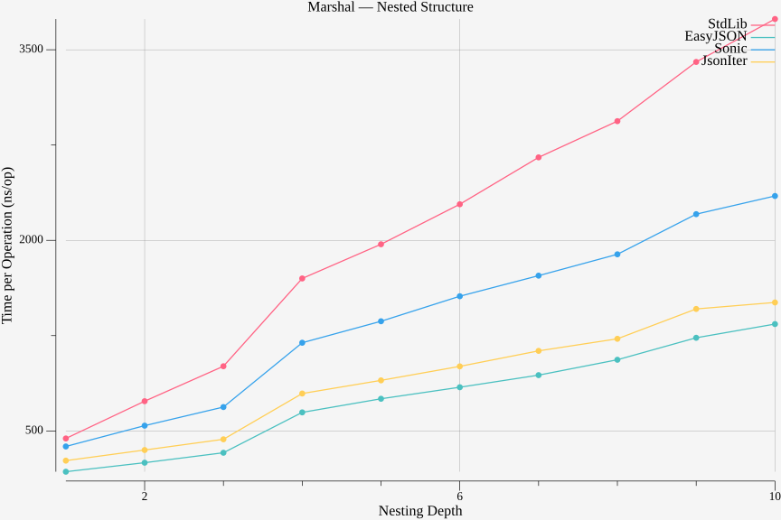

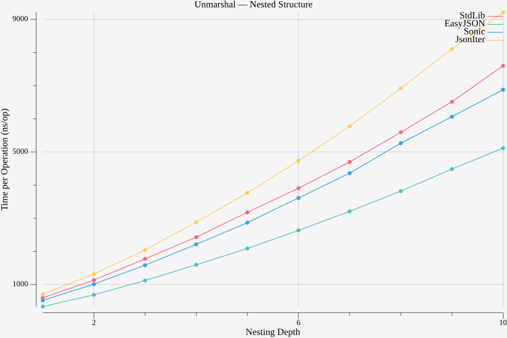

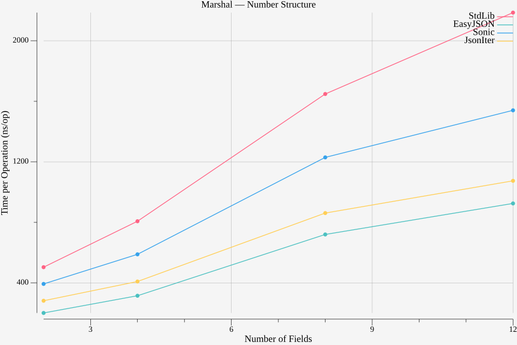

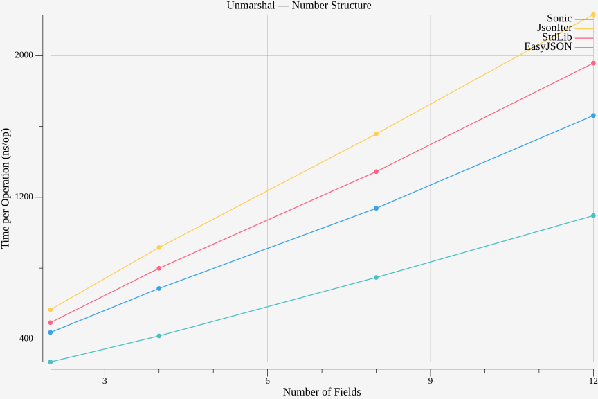

# How to Run

This project supports several run modes using the -mode flag:

`go run main.go -mode=<mode>`

Available modes:

* benchmark – run all Go benchmarks and store results in result/result.txt.

* result – generate plots and update the benchmarks section in README.md from the benchmark results.

* all – run both benchmarks and generate plots/README updates in one step.

* default is all.